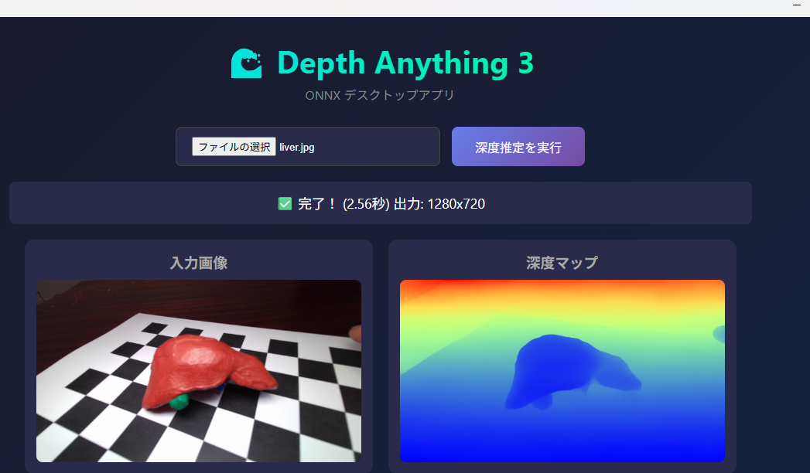

# Depth Anything V3 Desktop App

Tauriで作成した深度推定デスクトップアプリです。

## スクリーンショット



## ダウンロード

[Releases](https://github.com/meimeimei1223/da3-depth-app/releases) からexeをダウンロードしてください。

**モデル同梱済み** - ダウンロードしてすぐ使えます！

## 使い方

1. exeを起動
2. 「ファイルを選択」で画像を選ぶ
3. 「深度推定を実行」をクリック
4. 深度マップが表示されます

## 開発者向け

### 必要なもの

- Node.js 18+
- Rust

### セットアップ
```bash
git clone https://github.com/meimeimei1223/da3-depth-app.git
cd da3-depth-app
npm install
```

### モデルの準備

1. [onnx-community/depth-anything-v3-small](https://huggingface.co/onnx-community/depth-anything-v3-small) からダウンロード
2. Pythonで単一ファイルに変換：
```python
import onnx
model = onnx.load("onnx/model.onnx")
onnx.save(model, "src/models/model_single.onnx", save_as_external_data=False)
```

### 実行
```bash
npm run tauri dev
```

## クレジット

- [Depth Anything V3](https://github.com/ByteDance-Seed/Depth-Anything-3) by ByteDance (Apache 2.0)
- [onnx-community](https://huggingface.co/onnx-community/depth-anything-v3-small) (Apache 2.0)
- [Tauri](https://tauri.app/) (MIT)
- [ONNX Runtime](https://onnxruntime.ai/) (MIT)

## ライセンス

MIT License
